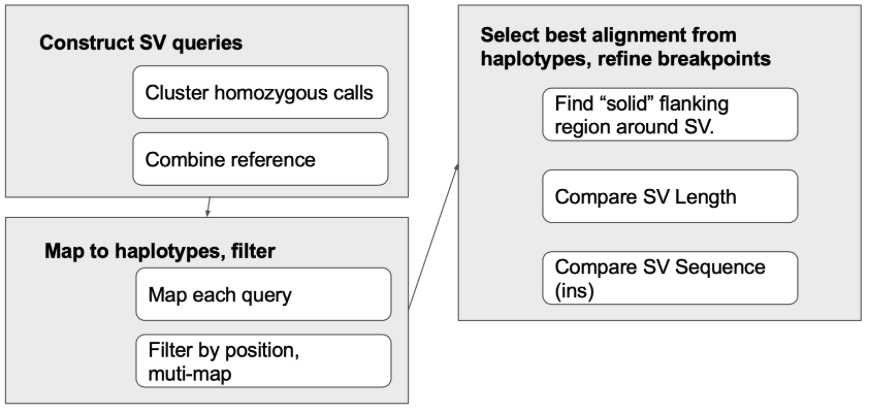

# Introduction

Benchmarking SV calling results is not always easy so here we provide a new method for verifying the presence of an SV in haplotype-resolved assemblies and compare results to Truvari. 

# What is XSVLen?

In X-SVLen we develop a framework to use haplotype-resolved assemblies for benchmarking SV detection algorithms.

XSVLen takes cuteSV or Sniffles VCF and using reference coordinates will produce modified sequences having included inserted sequences or deleted sequences withing the reference sequence. By creating this modified sequences we could check for the presence of the predicted variants in haplotype-resolved assemblies.

The resulting ‘query’ sequences are mapped to both haplotypes. 

Truvari annotation for a run using default parameters (except pctsim that is set equal to 0) and a permissive run using --refdist 1000 --pctsize 0 --multimatch will be parsed and all SVs processed for XSVLen will be annotated for including Truvari results for downstream comparisons.

A report summary will be produced using an R script. 

# What are the methods we implement?

Each aligned query may gives rise to a map of aligned bases P={(q1,t1), … , (qn,tn)}. To score the variant, we find the two indexes i,j, that index the end of the prefix, and beginning of the suffix in the query. When the call is valid, |(P[j][0] - P[i][0]) - (P[j][1] - P[j][0])| is 0. To account for differences in alignment, we iteratively search for an (iopt, jopt) combination, with iopt ≤ i and j ≤ jopt that gives the smallest difference. Variants are reported as valid if the difference is less than 10 bases or the intervals defined between P[iopt] and P[jopt] are within 95% length in either haplotype.

# Workflow diagram

# How to use XSVLen
  
A Nextflow workflow is produced

The workflow requires, python3, minimap2, nextflow, and R >=3.5.0.

